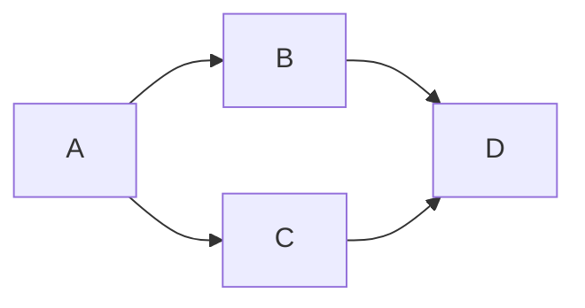
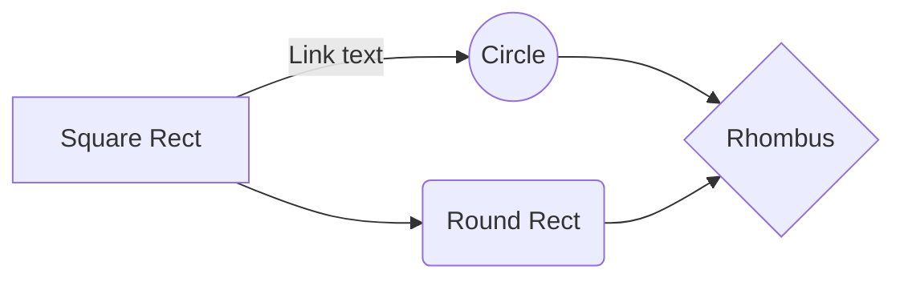

# java8-streams

## flow chart 1

```mermaid
graph LR
A --> B
A --> C
B --> D
C --> D
```

## flow chart 2

```mermaid
graph LR
A[Square Rect] -- Link text --> B((Circle))
A --> C(Round Rect)
B --> D{Rhombus}
C --> D
```
